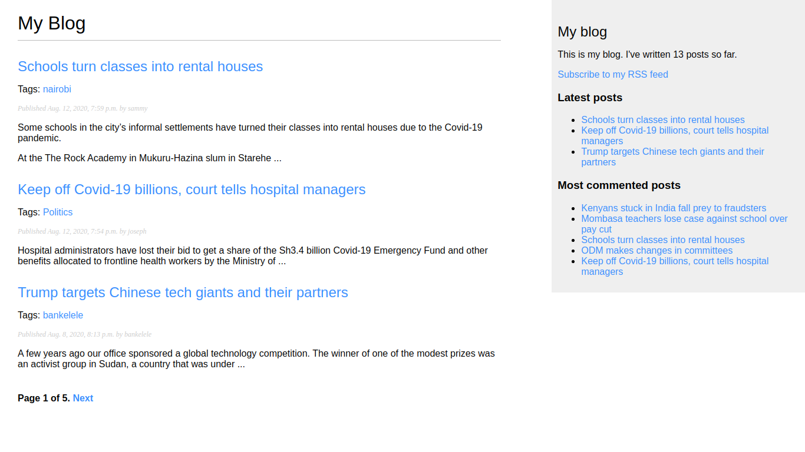

# Django Simple Blog

[Django Simple Blog](http://django-simple-blog-app.herokuapp.com/) is a personal blogging website where you can create and share you opinions and other users can read and comment on them.

# Features
- Paginated blog posts
- Share blog posts via email
- Comment system
- Integrate [django_taggit](https://github.com/alex/django-taggit)
- Custom template tags and filters
- [Sitemap](http://django-simple-blog-app.herokuapp.com/sitemap.xml) and [post feed](http://django-simple-blog-app.herokuapp.com/feed/)
- Retrieving posts by similarity
- Tagging functionality

# Demo
Here is a working live demo: http://django-simple-blog-app.herokuapp.com/

## Site

### [Landing Page](http://django-simple-blog-app.herokuapp.com/)
This page shows a list of paginated blog posts.

### View most recent posts and most commented posts

### Blog Post detail page

#### Share Page
This page allows a user to share a blog post via email.

#### Retrieving posts by similarity
Here you see a list of similar posts.

# [Usage](http://django-simple-blog-app.herokuapp.com/)

## Development
Want to contribute? Great@

To fix a bug or enhance an existing module, follow these steps:

- Fork the repo
- Create a new branch (`git checkout -b improve-feature`)
- Make the appropriate changes in the files
- Add changes to reflect the changes made
- Commit your changes (`git commit -am 'Improve feature'`)
- Push to the branch (`git push origin improve-feature`)
- Create a Pull Request

## Bug / Feature Request

If you find a bug, kindly open an issue [here](https://github.com/lwairore/django-simple-blog/issues/new).

If you'd like to request a new function, feel free to do so by opening an issue [here](https://github.com/lwairore/django-simple-blog/issues/new).

# Built with
- [Django](https://www.djangoproject.com/) - Django is a high-level Python Web framework that encourages rapid development and clean, pragmatic design. Built by experienced developers, it takes care of much of the hassle of Web development, so you can focus on writing your app without needing to reinvent the wheel. It's free and open source.
- [django_taggit](https://github.com/alex/django-taggit) - The *django-taggit* module is a reusable application that primarily offeres you a *Tag* model and a manager to easily add tags to any models.

# Team
[Karangu Lucas Wairore](https://github.com/lwairore)

# [License](LICENSE)
MIT © [Karangu Lucas Wairore](https://github.com/lwairore)
